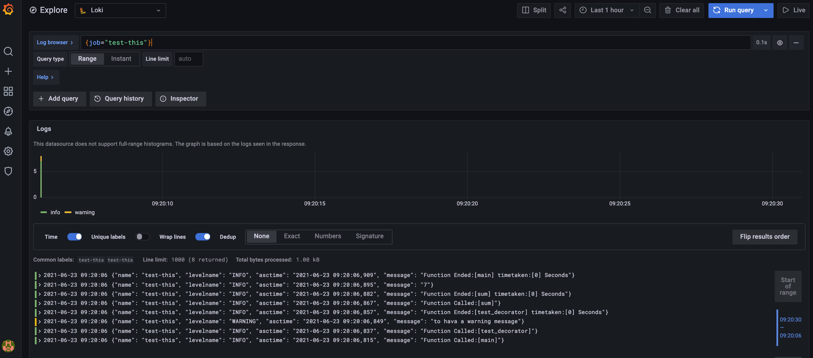

# json-log-decorator
python log decorator which raise on exception, logs stdout or to loki host, captures time taken by function or method in json format

To install package 
```
pip install json-log-decorator
```

* Example usage with just decorator
> NOTE: This takes file name as name while logging if no name provided
```python
from json_log_decorator.logdecorator import LogDecorator as log
import time

@log()
def test_decorator(x,y):
    time.sleep(2)
    return x + y

test_decorator(1,2)
```
> log's as below

```json
{"name": "test", "levelname": "INFO", "asctime": "2021-06-22 23:32:18,564", "message": "Function Called:[test_decorator]"}
{"name": "test", "levelname": "INFO", "asctime": "2021-06-22 23:32:20,568", "message": "Function Ended:[test_decorator] timetaken:[2] Seconds"}
```

* Incase of exception, it logs with error and raises the exception with adding additional field exc_info which has traceback rasie info 

```python
from json_log_decorator.logdecorator import LogDecorator as log
import time

@log()
def test_decorator(x,y):
    time.sleep(2)
    return x + y

test_decorator(1,'s')
```
> log's as below

```json
{"name": "test", "levelname": "INFO", "asctime": "2021-06-22 23:29:01,097", "message": "Function Called:[test_decorator]"}
{"name": "test", "levelname": "ERROR", "asctime": "2021-06-22 23:29:03,100", "message": "Exception in test_decorator", "exc_info": "Traceback (most recent call last):\n  File \"/json-log-decorator/json_log_decorator/logdecorator.py\", line 17, in wrapper\n    val = func(*args, **kwargs)\n  File \"/json-log-decorator/json_log_decorator/test.py\", line 7, in test_decorator\n    return x + y\nTypeError: unsupported operand type(s) for +: 'int' and 'str'"}
```

* To give a name to logger and for using this library to add other logging levels you can do this way

```python
from json_log_decorator.logdecorator import LogDecorator,get_logger

logger = get_logger('test-this')
log = LogDecorator(logger)

@log
def test_decorator(x,y):
    logger.warning('to hava a warning message')
    return x + y

@log
def sum(x):
    return x+2

@log
def main():
    x = sum(test_decorator(2,3))
    logger.info(x)

main()
```

* Logs can directly pushed to LOKI host , in this case you need to pass loki_host as shown below

> NOTE: this library only deals with version v1 loki python library

* Incase you want to try locally use below line to bring up grafana and loki locally , make sure you open grafana using admin and admin credentials and add datasource loki with `http://loki:3100` and save the data source

```bash
wget https://raw.githubusercontent.com/grafana/loki/v2.2.1/production/docker-compose.yaml -O docker-compose.yaml
docker-compose -f docker-compose.yaml up -d
```

```python
from json_log_decorator.logdecorator import LogDecorator,get_logger

logger = get_logger(name='test-this',loki_host='http://localhost:3100')
log = LogDecorator(logger)

@log
def test_decorator(x,y):
    logger.warning('to hava a warning message')
    return x + y

@log
def sum(x):
    return x+2

@log
def main():
    x = sum(test_decorator(2,3))
    logger.info(x)

main()
```

* Can be seen in LOKI as below 




* To set logging Level 

```python
import logging
from json_log_decorator.logdecorator import LogDecorator,get_logger

logger = get_logger('test-debug')
logger.setLevel(logging.DEBUG)
log = LogDecorator(logger)

@log
def test_decorator(x,y):
    logger.warning('just a warning test message')
    return x + y

@log
def sum(x):
    return x+2

@log
def main():
    x = sum(test_decorator(2,3))
    logger.info(x)

main()
```